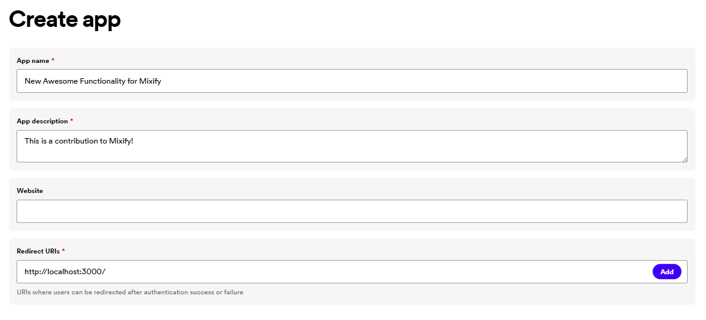
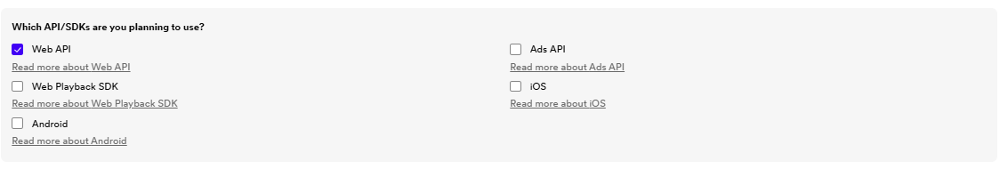
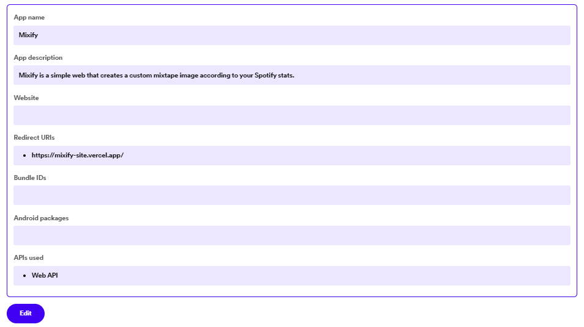
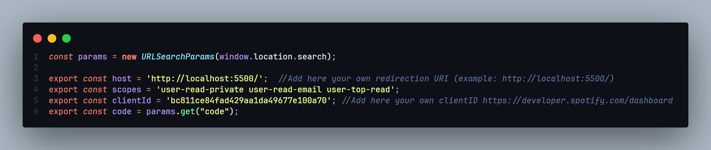

# [ENG] Welcome to the guide for contributing to Mixify.

Thank you for your interest in contributing to the project! Open source ensures the improvement of projects, bringing new features integrated by the community that seeks to improve existing projects.

## How to start the project 💯

- As we know, we are working with the Spotify API, which requires a couple of steps before starting. Once we have our project on our local machine, we will go to https://developer.spotify.com/ and after logging in, we will create a new project.

</img>

</img>

- Once we have our project on Spotify, we must do two things: copy our ClientID (found in the settings) and go to our project settings and add our redirection URI, in this case, http://localhost:5500/ (set the port you want).

</img>

To finish, we will go to ./scripts/utils/params.js and add our ClientID and the redirect URI that we have placed in the Spotify settings.

</img>

## Start collaborating! 🚀

Don’t be afraid to touch the project and change (or delete) things; what’s important here is to improve the project for everyone’s benefit. As long as good practices and clean code are maintained, any contribution is welcome (no matter how small!).

## Send your changes 📥

- First, make a commit with all your changes. Make sure to add clear and descriptive comments about your changes.

- Once ready, push to your fork, on the branch where you made the changes.

- At this point, create a Pull Request in the original repository by pressing the “Pull Request” button. Please, don’t forget to be clear and concise with the changes you have made! That would help me read your PR more easily.

### Thank you for your interest. 💜
Good luck with your contributions! I deeply appreciate all those who wish to collaborate on this small project.

# [ESP] Bienvenido a la guía para contribuir a Mixify.

¡Gracias por interesarte en contribuir en el proyecto! El código abierto asegura la mejora de los proyectos, trayendo nuevas funciones integradas por la comunidad que busca mejorar los proyectos ya existentes.

## Como comenzar el proyecto 💯

Como sabemos, estamos trabajando con la API de Spotify, lo cual requiere un par de pasos antes de comenzar.
Una vez tengamos nuestro proyecto en nuestra máquina local, vamos a dirigirnos a https://developer.spotify.com/ y luego de iniciar sesión, crearemos un nuevo proyecto.

</img>

</img>

Una vez tengamos nuestro proyecto en Spotify, debemos hacer dos cosas: copiar nuestro ClientID (encontrado en las configuraciones) e ir a las configuraciones de nuestro proyecto y agregar nuestro URI de redirección, en este caso, http://localhost:5500/ (coloca el puerto que quieras).

</img>

- Para finalizar, iremos a ./scripts/utils/params.js y agregaremos nuestro ClientID y el URI de redirección que hemos colocado en la configuración de Spotify.

</img>

## ¡Comienza a colaborar! 🚀

No tengas miedo de tocar el proyecto y cambiar (o borrar) cosas; lo importante aquí es mejorar el proyecto para el beneficio de todos. Mientras se mantengan las buenas prácticas y un código limpio, cualquier aportación es bien recibida (¡Sin importar lo pequeña que sea!).

## Envía tus cambios 📥

- Primeramente, haz un commit con todos tus cambios. Asegurate de agregar comentarios claros y descriptivos de tus cambios. 

- Una vez listo, haz un push a tu fork, en la rama donde hayas realizado los cambios.

- Una vez llegados a este punto, crea una Pull Request en el repositorio original, presionando el botón de "Pull Request". Por favor, ¡No olvides ser claro y conciso con los cambios que haz realizado! Eso me ayudaría a leer tu PR más fácilmente.

## Gracias por tu interes. 💜

¡Buena suerte en tus colaboraciones! Agradezco profundamente a todos los que desean colaborar en este pequeño proyecto.

